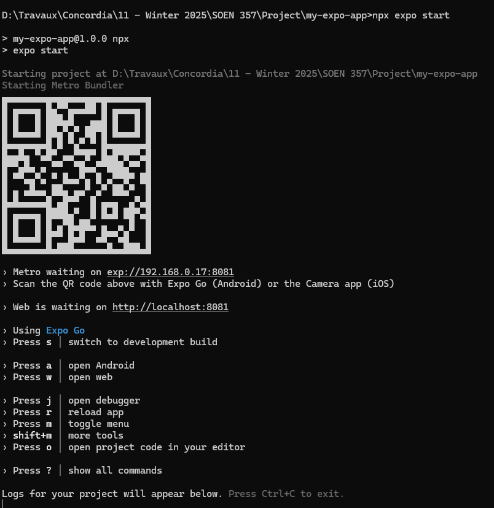

# 📱 PennyBank (Prototype)

This is a mobile app prototype built with [**Expo**](https://expo.dev/) and [**NativeWind**](https://www.nativewind.dev/) (Tailwind CSS for React Native). It is intended for rapid UI prototyping — no backend or complex business logic.

Created by Team ByteMe:

- Andrei Mihaescu, 40139389
- Mark Ghaby, 40201940
- Mahmoud Mustafa, 40252016
- Hannah Refour-Tannenbaum, 40243619
- Hudson Lu, 40254326

---

## 📸 Demo


---

## ✨ Getting Started

### 1. Clone the Repository

```bash
git clone https://github.com/andymiha/soen357_pennybank
cd soen357_pennybank
```

### 2. Install Dependencies

Make sure you have **Node.js** and **npm** installed, then run:

```bash
npm install
```

### 3. Start the App

```bash
npm start
```

This will open **Expo DevTools** in your browser and show a QR code in your terminal. What you should see:



---

## 📱 Running the App

### Option A: On a Real Device (Recommended)

1. Install the **Expo Go** app:

   - 📱 [Android](https://play.google.com/store/apps/details?id=host.exp.exponent)
   - 🍎 [iOS](https://apps.apple.com/app/expo-go/id982107779)

2. Open **Expo Go**, and scan the QR code shown in the terminal.

3. Your app should now launch on your phone!

---

### Option B: On an Emulator

> **Skip this if you're not using Android Studio or Xcode.**

To run the app in an emulator:

```bash
npm run android   # For Android (requires Android Studio)
npm run ios       # For iOS (requires Xcode & macOS)
```

---

## ⚠️ Common Issues

### ❌ Error: `'adb' is not recognized as...`

You don’t need to run `npm run android` unless you have Android Studio. Use **Expo Go** instead.

### ❌ Error: `expo start --ios` fails

This command is for macOS with Xcode. Use **Expo Go** or run `npm start`.

---

## 🧱 Stack

- [Expo (React Native)](https://expo.dev/)
- [NativeWind](https://www.nativewind.dev/)
- [TypeScript](https://www.typescriptlang.org/)
- [TailwindCSS-style utility classes](https://tailwindcss.com/)

---

## 📦 Setup Info

This project was bootstrapped using:

```bash
npx create-expo-stack@latest --nativewind
```

---

## 🛋️ Optional Dev Tools

You can install these if you prefer to emulate the app on web:

```bash
npm install --global eas-cli
eas login
```
